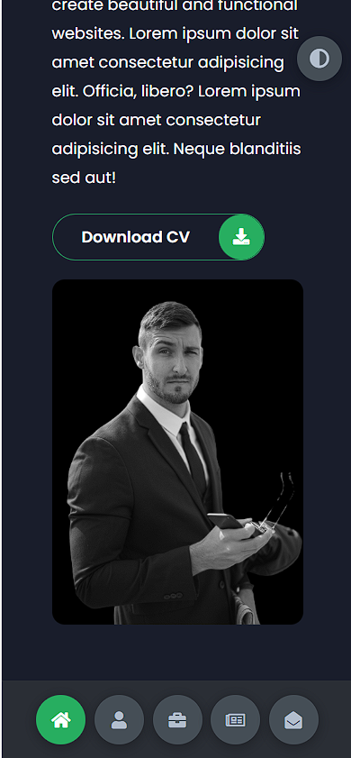

# Trang web thông tin cá nhân

Bài tập lớn cho môn nền tảng phát triển web. Địa chỉ url tại https://admirable-treacle-03520c.netlify.app/. Link github cho trang quản lý tại https://github.com/chi-cong/portfolio-management

## Công nghệ được sử dụng

- Trang web được viết HTML - CSS - vanila JavaScript. Không sử dụng các thư viện mở rộng
- Các icon được sử dụng thuộc Google font

## Các thành phần chính của trang web

- Trang Home
- Trang About
- Trang Portfolio
- Trang Blogs
- Trang Contact
- Cụm phím ( navbar trên giao diện mobile ) di chuyển qua lại giữa các trang
- Phím chuyển chế độ sáng / tối

## Một số hình ảnh Project

Giao diện chế độ tối

Giao diện chế độ sáng

Giao trên điện thoại

Giao diện trang blogs

